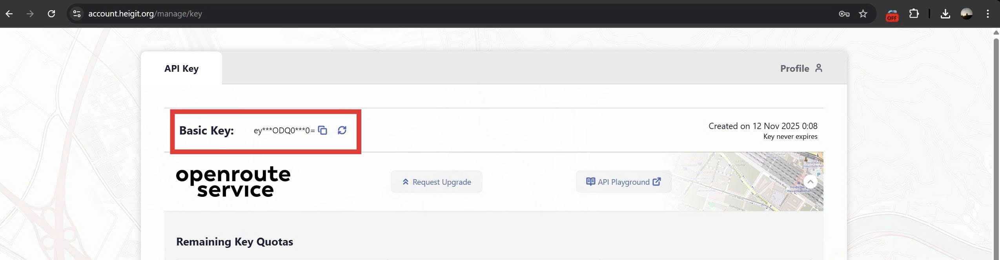
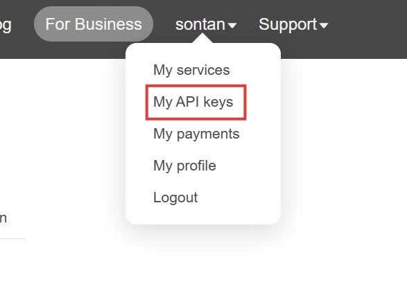

# 🌿 Nền tảng Dự báo Chất lượng Không khí Siêu địa phương và Điều hướng Xanh tại TP.HCM
**Team: UMT.FreeFireFiles**

[](https://olp.vn/)
[](https://opensource.org/licenses/Apache-2.0)
[]()
[](https://olp.umtoj.edu.vn/app/rescue-app/citizenpage-673f7d3ae443011fab9eaaab?branch=main)

---

<div align="center">

  <a href="https://github.com/tannguyen1129/UMT.FreeFireFlies/issues/new?template=bao_cao_loi.md">
    
  </a>
  &nbsp;&nbsp;
  <a href="https://github.com/tannguyen1129/UMT.FreeFireFlies/issues/new?template=yeu_cau_tinh_nang.md">
    
  </a>

</div>

---

## 📖 1. Giới Thiệu

**Green-AQI Navigator** là một hệ thống microservices đầy đủ, được xây dựng hoàn toàn trên các tiêu chuẩn **Dữ liệu Mở Liên kết (LOD)** và **Web Ngữ nghĩa**.

Hệ thống sử dụng **FIWARE Orion-LD Context Broker** làm trung tâm thần kinh. Dữ liệu được thu thập, xử lý, và truy vấn dưới dạng các thực thể (Entities) JSON-LD đã được chuẩn hóa (sử dụng ontology của [SmartDataModels](https://smartdatamodels.org/)).

### 🏆 Thông tin Cuộc thi
Dự án được thực hiện nhằm mục đích tham gia bảng [Phần mềm Nguồn Mở](https://www.olp.vn/procon-pmmn/ph%E1%BA%A7n-m%E1%BB%81m-ngu%E1%BB%93n-m%E1%BB%9F) trong khuôn khổ **Kỳ thi Olympic Tin học sinh viên Việt Nam lần thứ 34** tổ chức tại [Trường Đại học Công nghệ Thành phố Hồ Chí Minh (HUTECH)](https://www.hutech.edu.vn/) từ ngày 09/12/2025 đến ngày 12/12/2025.

### 📄 Bản quyền
Phần mềm được đội ngũ tác giả của **UMT.FreeFireFiles** open source theo giấy phép [Apache 2.0 License](https://www.apache.org/licenses/LICENSE-2.0).

**🔗 Live Demo:** [Bấm vào đây để trải nghiệm ngay](https://olp.umtoj.edu.vn/app/rescue-app/citizenpage-673f7d3ae443011fab9eaaab?branch=main)

---

## 📑 Mục lục tài liệu

1. [Giới Thiệu](#1-giới-thiệu)
2. [Tổng quan hệ thống](#2-tổng-quan-hệ-thống)
3. [Chức năng](#3-chức-năng)
4. [Screens Flow của dự án](#4-screens-flow-của-dự-án)
5. [Hướng dẫn cài đặt](#5-hướng-dẫn-cài-đặt)
    - [5.1. 📋 Yêu cầu - Prerequisites](#51-yêu-cầu---prerequisites)
    - [5.2. 🔥 Dựng APIs (Backend)](#52-dựng-apis-backend)
    - [5.3. 🔨 Cài đặt Client](#53-cài-đặt-client)
6. [Đóng góp](#6-đóng-góp)
7. [Liên lạc](#7-liên-lạc)
8. [License (Giấy phép)](#8-license-giấy-phép)

---

## 2. Tổng quan hệ thống

Dự án áp dụng kiến trúc **Microservices** hiện đại, đảm bảo tính mở rộng và linh hoạt.

* **Core:** [FIWARE Orion-LD Context Broker](https://github.com/FIWARE/context.Orion-LD) (Quản lý ngữ cảnh & Dữ liệu liên kết).
* **Backend (NestJS):**
    * `api-gateway`: Cổng giao tiếp tập trung.
    * `aqi-service`: Thu thập dữ liệu đa nguồn (Agents), Logic nghiệp vụ.
    * `notification-service`: Hệ thống cảnh báo thông minh (Polling & FCM).
    * `user-service`: Quản lý người dùng & Gamification.
    * `auth-service`: Xác thực JWT.
* **AI Module (Python):** Mô hình **ST-GNN** (Spatio-Temporal Graph Neural Network) dự báo PM2.5 dựa trên Không gian (Graph) & Thời gian (LSTM).
* **Database:** PostgreSQL (PostGIS - Dữ liệu không gian), MongoDB (Context Data).
* **Frontend:**
    * **Mobile App:** Flutter (Dành cho Công dân).
    * **Web Dashboard:** Next.js (Dành cho Quản lý).

---

##  3. Chức năng

### A. Ứng dụng Công dân (Mobile App)

| Tính năng | Mô tả & Công nghệ |
| :--- | :--- |
| **🗺️ Bản đồ Nhiệt (Heatmap)** | Hiển thị lớp phủ ô nhiễm mịn màng toàn thành phố nhờ thuật toán nội suy **IDW**. |
| **🌱 Tìm đường Xanh** | Gợi ý lộ trình đi tránh các vùng ô nhiễm cao, ưu tiên đi qua công viên/cây xanh. |
| **🚗 Dẫn đường Real-time** | Chế độ dẫn đường thời gian thực, tự động cảnh báo khi đi vào vùng ô nhiễm. |
| **🗣️ Khoa học Công dân** | Người dân gửi cảm nhận ("Mặt cười/Mếu") về không khí tại chỗ. |
| **⚠️ Báo cáo Sự cố** | Chụp ảnh, định vị và gửi báo cáo các điểm đốt rác, bụi bặm xây dựng. |
| **🏥 Trợ lý Sức khỏe** | Cảnh báo cá nhân hóa dựa trên hồ sơ bệnh lý (Người già, Hen suyễn...). |
| **🏆 Gamification** | Tích "Điểm Xanh" khi hoàn thành lộ trình sạch. Bảng xếp hạng thi đua. |

### B. Web Dashboard (Quản lý)

* **Trung tâm Giám sát (Monitoring Map):** Cái nhìn toàn cảnh (God-mode) với các lớp dữ liệu: Trạm quan trắc, Sự cố, Cảm nhận dân sinh.
* **Phân tích Dữ liệu (Analytics):** Biểu đồ xu hướng AQI, Tương quan giữa Mật độ giao thông và Ô nhiễm (Data-driven insights).
* **Quản lý Sự cố:** Quy trình duyệt/từ chối báo cáo khép kín. Hệ thống tự động gửi thông báo về App người dân khi xử lý xong.

---

## 4. Kiến trúc của dự án


---

## 5. Hướng dẫn cài đặt

### 5.1. Yêu cầu - Prerequisites
#### 1. Cài đặt Docker và Docker compose

Gỡ bản Docker cũ (nếu có)
```bash
sudo apt-get remove docker docker-engine docker.io containerd runc
```

Cài các package hỗ trợ
```bash
sudo apt-get update
sudo apt-get install -y ca-certificates curl gnupg lsb-release
```

Thêm GPG key
```bash
sudo mkdir -p /etc/apt/keyrings
curl -fsSL https://download.docker.com/linux/ubuntu/gpg | sudo gpg --dearmor -o /etc/apt/keyrings/docker.gpg
```

Thêm repo Docker
```bash
echo \
  "deb [arch=$(dpkg --print-architecture) signed-by=/etc/apt/keyrings/docker.gpg] \
  https://download.docker.com/linux/ubuntu \
  $(lsb_release -cs) stable" | sudo tee /etc/apt/sources.list.d/docker.list > /dev/null
```

Cài Docker Engine + Docker Compose plugin (v2)
```bash
sudo apt-get update
sudo apt-get install -y docker-ce docker-ce-cli containerd.io docker-buildx-plugin docker-compose-plugin
```


Kiểm tra version
```bash
docker --version
docker compose version
```


### 5.2. Dựng APIs (Backend)

Chúng tôi cung cấp file `docker-compose.yml` để khởi chạy toàn bộ hạ tầng Backend một cách dễ dàng

1.  **Lấy Key API các nền tảng cần thiết**

    *Lấy key của openrouteservice API*

    Bước 1: Vào website: https://api.openrouteservice.org/

    Bước 2: Chọn Sign up. Sau đó đăng ký tài khoản và kích hoạt tài khoản ở email hoặc sign up với email

    Bước 3: Đăng nhập bằng tài khoản mới tạo. Vừa đăng nhập bạn sẽ thấy chỗ lấy API Key

    

    *Lấy key của openrouteservice API*

    Bước 1: Vào website tại địa chỉ: https://home.openweathermap.org/users/sign_up để tạo tài khoản

    Bước 2: Đăng ký thành công và quay lại đăng nhập. Chọn tên tài khoản gốc trên bên phải sau đó chọn "My API Keys"
    
    Bước 3: Copy API key có sẵn hoặc tự tạo mới bằng nút "Generate" phía bên phải

    

2.  **Clone repository:**
    ```bash
    git clone https://github.com/tannguyen1129/UMT.FreeFireFlies.git green-aqi-navigator
    cd green-aqi-navigator
    ```
3.  **Cấu hình biến môi trường:** Copy `.env.example` thành `.env` và điền API Key.
4.  **Khởi chạy hệ thống:**

    *Tạo green net work*
    ```bash
    docker network create green-net
    ```
    
    *Lệnh này sẽ khởi động: MongoDB, Orion-LD*
    ```bash
    docker compose -f docker-compose.fiware.yml up -d
    ```

    *Lệnh này sẽ khởi động: PostgreSQL, API Gateway, Microservices*
    ```bash
    docker compose up --build -d
    ```

### 5.3. Cài đặt frontend cho Citizen (Mobile)

1.  **Xem cài đặt Android Studio và Flutter tại đây**
2.  **Clone repository:**
    ```bash
    git clone https://github.com/tannguyen1129/UMT.FreeFireFlies-frontend.git frontend_citizen
    ```


### 5.4. Cài đặt Web Admin/Goverment

1.  **Clone repository:**
    ```bash
    git clone https://github.com/tannguyen1129/UMT.FreeFireFlies-frontend.git green-aqi-dashboard
    ```
2.  **Chạy lệnh docker**
```bash
    docker compose up --build -d
```
---

## 6. Quản lý Người dùng & Phân quyền (User & Roles)

Hệ thống đã được thiết lập sẵn mô hình **Role-Based Access Control (RBAC)** với 3 cấp độ người dùng. Dưới đây là thông tin đăng nhập mặc định để Ban giám khảo kiểm thử.

### 📋 Danh sách Tài khoản Mặc định (Default Credentials)

| Vai trò (Role) | Email | Mật khẩu | Nền tảng truy cập | Quyền hạn |
| :--- | :--- | :--- | :--- | :--- |
| **Công dân (Citizen)** | `user@gmail.com` | `Password123` | **Mobile App** | Xem bản đồ, Tìm đường xanh, Báo cáo sự cố, Tích điểm. |
| **Cán bộ (Gov Official)** | `gov@green.aqi` | `Password123` | **Web Dashboard** | Xem bản đồ giám sát, Duyệt/Từ chối sự cố, Phân tích dữ liệu. |
| **Quản trị viên (Admin)** | `admin@green.aqi`| `Password123` | **Web Dashboard** | Quản trị hệ thống, Quản lý người dùng, Cấu hình tham số. |

---

### ⚙️ Hướng dẫn Khởi tạo lại Dữ liệu (Database Seeding)

Trong trường hợp triển khai mới (Clean Deploy) hoặc Database bị xóa, hãy thực hiện các bước sau để tái tạo lại bộ tài khoản chuẩn và cấu trúc bảng.

#### Bước 1: Cập nhật Database thủ công (Quan trọng nhất)

Chúng ta sẽ bơm đầy đủ **Cột (Columns)** và **Quyền (Roles)** vào Database để đảm bảo hệ thống không bị lỗi khi lưu dữ liệu.

---

##### 1.1 Truy cập vào PostgreSQL trong Docker

Chạy lệnh sau:

```bash
sudo docker exec -it green-aqi-postgres psql -U postgres -d green_aqi_db
```

##### 1.2. Thêm roles và các cột còn thiếu (nếu có)

```bash
-- 1. Tạo bảng roles và thêm dữ liệu nếu chưa có
CREATE TABLE IF NOT EXISTS roles (
  role_id SERIAL PRIMARY KEY,
  role_name VARCHAR(50) UNIQUE NOT NULL
);

INSERT INTO roles (role_name) VALUES 
('citizen'), 
('admin'), 
('government_official')
ON CONFLICT (role_name) DO NOTHING;

-- 2. Thêm các cột còn thiếu vào bảng Users (Quan trọng cho Admin/Gov)
ALTER TABLE users ADD COLUMN IF NOT EXISTS agency_department VARCHAR(255);
ALTER TABLE users ADD COLUMN IF NOT EXISTS health_group VARCHAR(50) DEFAULT 'normal';
ALTER TABLE users ADD COLUMN IF NOT EXISTS green_points INTEGER DEFAULT 0;

-- 3. Đảm bảo bảng user_roles tồn tại
CREATE TABLE IF NOT EXISTS user_roles (
  user_id uuid REFERENCES users(user_id) ON DELETE CASCADE,
  role_id integer REFERENCES roles(role_id) ON DELETE CASCADE,
  PRIMARY KEY (user_id, role_id)
);
```

#### Bước 2: Đăng ký 3 tài khoản qua API
Chạy lệnh sau trên Terminal (VPS hoặc Localhost):

```bash
# 1. Tạo Admin
curl -X POST http://localhost:3003/auth/register \
-H 'Content-Type: application/json' \
-d '{"email":"admin@green.aqi", "password":"Password123", "fullName":"Super Admin", "phoneNumber":"0909000001", "agencyDepartment":"System Admin"}'

# 2. Tạo Cán bộ (Gov)
curl -X POST http://localhost:3003/auth/register \
-H 'Content-Type: application/json' \
-d '{"email":"gov@green.aqi", "password":"Password123", "fullName":"Can Bo Moi Truong", "phoneNumber":"0909000002", "agencyDepartment":"So TNMT"}'

# 3. Tạo Công dân (User)
curl -X POST http://localhost:3003/auth/register \
-H 'Content-Type: application/json' \
-d '{"email":"user@gmail.com", "password":"Password123", "fullName":"Nguyen Van Dan", "phoneNumber":"0909000003"}'
```

#### Bước 3: Cấp quyền (Promote Roles) & Bổ sung cấu trúc bảng

Chạy lại lệnh sau:

```bash
sudo docker exec -it green-aqi-postgres psql -U postgres -d green_aqi_db
```

```bash
-- A. Bổ sung các cột dữ liệu (Nếu thiếu)
ALTER TABLE users ADD COLUMN IF NOT EXISTS agency_department VARCHAR(255);
ALTER TABLE users ADD COLUMN IF NOT EXISTS health_group VARCHAR(50) DEFAULT 'normal';
ALTER TABLE users ADD COLUMN IF NOT EXISTS green_points INTEGER DEFAULT 0;

-- C. Thăng cấp cho Admin
INSERT INTO user_roles (user_id, role_id)
SELECT u.user_id, r.role_id FROM users u, roles r
WHERE u.email = 'admin@green.aqi' AND r.role_name = 'admin'
ON CONFLICT DO NOTHING;

-- D. Thăng cấp cho Cán bộ
INSERT INTO user_roles (user_id, role_id)
SELECT u.user_id, r.role_id FROM users u, roles r
WHERE u.email = 'gov@green.aqi' AND r.role_name = 'government_official'
ON CONFLICT DO NOTHING;

-- E. Dọn dẹp quyền thừa (Xóa quyền citizen mặc định của Admin/Gov)
DELETE FROM user_roles
WHERE role_id = (SELECT role_id FROM roles WHERE role_name = 'citizen')
AND user_id IN (SELECT user_id FROM users WHERE email IN ('admin@green.aqi', 'gov@green.aqi'));
```

## 7. Đóng góp
Dự án tuân thủ tinh thần nguồn mở. Mọi đóng góp (Pull Request) đều được hoan nghênh.
1.  Fork dự án.
2.  Tạo nhánh (`git checkout -b feature/AmazingFeature`).
3.  Commit (`git commit -m 'Add some AmazingFeature'`).
4.  Push (`git push origin feature/AmazingFeature`).
5.  Mở Pull Request.

---

## 8. Liên lạc

**Team UMT.FreeFireFiles** - Đại học Quản lý và Công nghệ Thành phố Hồ Chí Minh

* **Lead Developer:** Sơn Tân
* **Email:** tandtnt15@gmail.com
* **Repository:** [Github Link](https://github.com/tannguyen1129/green-aqi-navigator)

---

## 9. License (Giấy phép)

Distributed under the Apache 2.0 License. See `LICENSE` for more information.

## 10. Phụ lục

### Hướng dẫn lấy Firebase Admin SDK Key (Service Account)

Tài liệu này hướng dẫn cách lấy file `json` xác thực từ Google Firebase để Backend (Notification Service) có thể gửi thông báo.

#### Bước 1: Truy cập Firebase Console
1. Truy cập vào [Firebase Console](https://console.firebase.google.com/).
2. Chọn dự án **Green AQI** (hoặc dự án bạn đang làm việc).

#### Bước 2: Vào phần Cài đặt dự án (Project Settings)
1. Nhìn sang menu bên trái, bấm vào biểu tượng **Bánh răng (Settings)** ⚙️ bên cạnh dòng chữ "Project Overview".
2. Chọn **Project settings** (Cài đặt dự án).

#### Bước 3: Tạo khóa bí mật (Service Account)
1. Trên thanh menu ngang phía trên, chọn tab **Service accounts** (Tài khoản dịch vụ).
2. Ở phần **Firebase Admin SDK**, hãy chắc chắn rằng tùy chọn **Node.js** đang được chọn.
3. Bấm vào nút màu xanh **Generate new private key** (Tạo khóa riêng tư mới).


4. Một cửa sổ cảnh báo hiện ra, bấm **Generate key** để xác nhận.
5. Một file có đuôi `.json` sẽ tự động được tải xuống máy tính của bạn.

---

#### Bước 4: Cấu hình vào dự án (Quan trọng)

Theo cấu hình `docker-compose.yml` hiện tại của dự án, bạn cần thực hiện đổi tên và di chuyển file này đúng chỗ:

##### 1. Đổi tên file
File vừa tải về thường có tên dài (ví dụ: `project-name-firebase-adminsdk-xyz.json`).
👉 Hãy đổi tên nó thành: **`firebase-admin-key.json`**

##### 2. Di chuyển vào thư mục dự án
Di chuyển file `firebase-admin-key.json` vào đường dẫn sau trong source code của bạn:

```text
apps/notification-service/firebase-admin-key.json